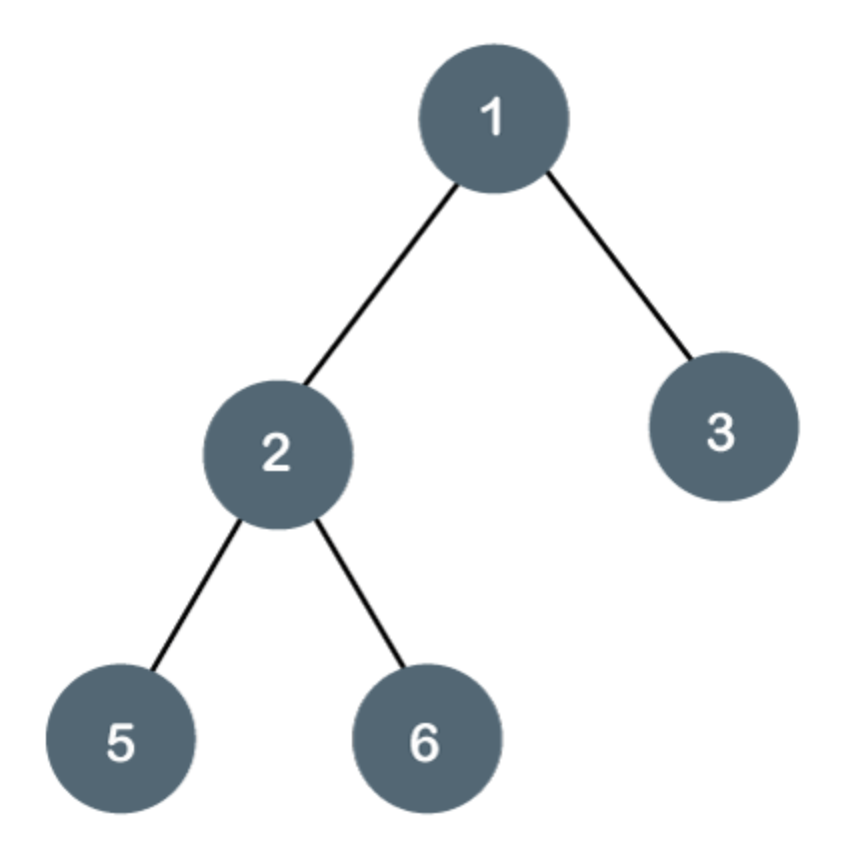

# Binary Search Trees
**Binary search trees** They are an advance algorithm (data structures) that can help to analize, and organize data with nodes. In a BST there is a root which will be the first node, and then it will have 2 child nodes. We will classify these child nodes as left branch and right branch. A sub-tree is anything that is a descendant of any given node. We use sub-trees to determine if the value inside of a node is lesser or greater than a node. The reason BST's are so useful is for their speed. Since we start with a root node it will contain a value, for example, lets say it contains the number 5. We add a value to the BST by checking if the new node value is greater or lesser than the root value. If the value is greater than the root node it will become the roots right node. If the value is lesser it till be the root nodes left node. This not only works for the root node but for every node in the BST. Here is an image of that BST would look like, try to figure out where the 9 would go:


 Have tried to figure out where the 9 goes? First lets take a look at the root node, which happens to be the 8. Since all numbers that will be in the right sub-tree of 8 will be greater we can move to the right and get to 10. Now we will check if 9 is less than or greater than 10. Since 9 is less than 10 we will make 10's left node to be 9. We traverse through a BST by using recusion and comparing values. We would compare 9 to 10 and see that it needs to go on the left side. Since 10's left node was empty we were able to put the 9 there. If it was not empty, we would continue traversing until we found a spot for the 9.

<br>

## Performance Table

|       Description         |      Performance     |        Code         |
|      :-----------:        |     :------------:   | :---------------:   |
|  Adding node to the BST   |       O(log n)       |    BST.insert(Node) |
|  Removing node from BST   |       O(log n)       |    BST.remove(Node) |
|  Traversing through BST   |       O(n)           |    traverse_forwards|
|  Traversing through BST   |       O(n)           |    traverse_reverse |     
|  Checking if value in BST |       O(log n)       |    Contains(Values) |
|  Height of node in BST    |       O(n)           |    BST.height(Node) |
|  Determine if BST is empty|       O(1)           |    BST.empty()      |
|  Determining size of BST  |       O(1)           |    BST.size()       |


 Every functionality to a BST is O(n) or faster. For example, lets say we are looking for the node containing the number 5 and the root node contains the number 1. Since we know 5 is greater than 1 we don't even have to search through the left side of the BST. See how fast that is? With just the first comparison we can cut the search by half immediately.

<br>

## Height of a BST
We determine the height of a BST by getting the largest amount of nodes between a leaf node and the target node. A leaf node is a node that has no child nodes. Lets use this picture as an example:



Let's start at the root. I like to count from the target node to the leaf farthest away from it. We will count each node from the root to the furthest leaf node. In our case 3 and -4 will be the 2 furthest leaf nodes. The height of the root to 18 will be 2 since there is the root and 18 in that tree. With that same logic lets find the height of the left tree. What is the height of the BST? Since we will take the largest path the height of the BST will be 3. We know this is 3 because we will count the root, the node with value 2, and the node with -4 will get us 3. We can also get to the node with 3 and use that since they are both of equal height.

<br>

## Balanced BST
A balanced BST is a BST that does not have a dramatic difference of height between the right sub-tree and the left sub-tree. If any side tree has a greater height by 2 or more will cause the BST to be unbalanced. The reason why a unbalanced tree is bad is because it starts to become more and more like a linked list. If out BST becomes more and more like a linked list the slower it gets. Lets take a look at an unbalanced BST:


As you can see the right sub-tree is so much bigger than the left side. Now lets talk about why this is bad. If I were to ask you to search for the 6 in the BST how many nodes will you go through before you find it? Since 6 is the furthest leaf it will be the same as the height which is 5. That is really slow but, what if the data were put in differently. Lets say the order we put the numbers is this order: 4,2,5,3,1,6. Now lets look at the image below to see what the new BST will look like:


Now lets try to find 6 again and how long it takes. The amount of nodes checked will be 3 compared to 5. Might not seem like a crazy jump but, lets say this BST had 10,000 nodes and trying to look for the node with the value 9288. If the BST was unbalanced it would take a much longer amount of time to find the value.

<br>

## Example of Inserting to a binary tree
``` python
def insert(self, data):
    """
    Insert data into the BST. If the BST is empty,
    make the value the node. Else, traverse through the
    BST.
    """

    if self.root is None:
        self.root = BST.Node(data)
    else:
        self._insert(data, self.root)


def _insert(self, data, node):
    """
    Recursively call the _insert function until you find
    and empty place to put the node.
    """

    # If the data is less than the current nodes data,
    # go down the left sub-tree.
    if data < node.data:

        # Set current node's left node to
        # the given node since there is an empty spot.
        if node.left is None:
            node.left = BST.node(data)

        # Call if the spot is not empty.
        else:
            self._insert(data, node.left)

    # If the data is greater than the current nodes data,
    # go down the right sub-tree.
    elif data >= node.data:

        # Set current node's right node to
        # the given node since there is an empty spot.
        if node.right is None:
            node.right = BST.node(data)

        # Call if the spot is not empty.
        else:
            self._insert(data, node.right)
```
<br>

# Problem to solve
In this problem you are given an option to fix some mistakes, and writing out your own functions for a BST as well. There are going to be 4 things to do for this problem which consist of: 

* Fix the _insert function and get it working right 
* Make the empty() function for the BST
* Fix the _containing function to make sure it is working correctly
* Write code for the _get_sum() function to get the sum of all the nodes in the BST

Make sure to look back and forth between the lesson and your code. BST's are a complicated concept since they use recursion. I find it easiest to draw out the BST on paper and make sure my code is doing exactly what I have drawn on paper. Best of luck on the assignment! If you have finished your program, go ahead and compare your code with mine at the bottom of this document! Happy coding.

<br>

```python
class BST:
    """
    Implement the Binary Search Tree (BST) data structure. We will create
    a inner class of node for the BST class.
    """

    class Node:
        """
        Each node of the BST will have data and links to the 
        left and right sub-tree if there happens to be any. 
        """

        def __init__(self, data):
            """
            Initialize the node class.
            """
            self.data = data
            self.left = None
            self.right = None


    def __init__(self):
        """
        Initialize an empty BST.
        """
        self.root = None


    def insert(self, data):
        """
        This method will check if the root is None.
        The reason for this is because if the BST is empty,
        it will make the node the root. If the BST is not empty,
        traverse through the tree to find the spot to add the node.
        """
        if self.root is None:
            self.root = BST.Node(data)
        else:
            self._insert(data, self.root)  # Start at the root


    def _insert(self, data, node):
        """
        This function will look for a place to insert a node to 
        the BST. If the user tries to add a number that is not
        unique, it will return ending the _insert method.

        There has been added mistakes to the code for you to figure out.
        Hint: Use pen and paper to draw the insert function, and see what is
        acutally happening. Are they going to the right spots?
        """
        if data == node.data:
            return

        if data > node.data:
            # The data belongs on the left side.
            if node.left is None:
                # We found an empty spot
                node.left = BST.Node(data)
            else:
                # Need to keep looking.  Call _insert
                # recursively on the left sub-tree.
                self._insert(data, node.left)

        elif data < node.data:
            # The data belongs on the right side.
            if node.right is None:
                # We found an empty spot
                node.right = BST.Node(data)
            else:
                # Need to keep looking.  Call _insert
                # recursively on the right sub-tree.
                self._insert(data, node.right)


    def empty(self):
        """
        Return True if tree is empty, return false
        if not empty.
        """
        pass


    def __contains__(self, data):
        """ 
        Checks if data is in the BST.  This function
        supports the ability to use the 'in' keyword:

        if 5 in my_bst:
            ("5 is in the bst")

        """
        return self._contains(data, self.root)  # Start at the root


    def _contains(self, data, node):
        """
        This funciton will search for a node that contains
        'data'.  The current sub-tree being search is 
        represented by 'node'.  This function is intended
        to be called the first time by the __contains__ function.
        """

        #Base Case #1: Data is not in tree
        if node is not None:
            return False

        #Base Case #2: Data is in the tree.
        elif data == node.data:
            return True

        # Smaller problem: Recurse through the tree.
        else:
            if data > node.data:
                return self._contains(data, node.left)
            else:
                return self._contains(data, node.right)


    def __iter__(self):
        """
        Perform a forward traversal (in order traversal) starting from 
	    the root of the BST.  This is called a generator function.
        This function is called when a loop	is performed:

        for value in my_bst:
            print(value)

        """
        yield from self._traverse_forward(self.root)  # Start at the root


    def _traverse_forward(self, node):
        """
        This function allows us to iterate through
        the BST and output the tree in order.
        """
        if node is not None:
            yield from self._traverse_forward(node.left)
            yield node.data
            yield from self._traverse_forward(node.right)


    def get_sum(self):
        """
        Get the sum of the right subtree.
        """
        if self.root is None:
            return 0
        else:
            return self._get_sum(self.root)


    def _get_sum(self, node):

        """
        Traverse through the BST and add all the data together.

        Find the sum of all the node's data and return the total.
        Hint: traverse through the left sub-tree and get the sum, 
        traverse through the right sub-tree and get the sum, after that
        is done add the node, left sub-tree sum, and the right sub-tree sum
        together to get the sum of the whole tree.
        """
        pass


print("\n=========== PROBLEM 1 TESTS ===========")
tree = BST()
tree.insert(2)
tree.insert(3)
tree.insert(1)
tree.insert(4)
tree.insert(5)
tree.insert(6)

# Output: 1, 2, 3, 4, 5, 6
for x in tree: 
    print(x) 


print("\n=========== PROBLEM 2 TESTS ===========")
print(tree.empty()) # Output: False

# Create an empty tree.
tree2 = BST()
print(tree2.empty()) # Output: True
tree2.insert(3)
tree2.insert(15)
tree2.insert(-21)
tree2.insert(82)
print(tree2.empty())  # Output: False

print("\n=========== PROBLEM 3 TESTS ===========")
print(99 in tree2) # False
print(30 in tree2) # True
print(65 in tree2) # False
print(6 in tree2) # True

print("\n=========== PROBLEM 4 TESTS ===========")
tree3 = BST()
tree3.insert(15)
tree3.insert(4)
tree3.insert(81)
tree3.insert(90)
tree3.insert(-10)
tree3.insert(-5)
tree3.insert(8)
print("Sum of tree is: " + str(tree.get_sum())) # Output: 21
print("Sum of tree2 is: " + str(tree2.get_sum())) # Output: 108
print("Sum of tree3 is: " + str(tree3.get_sum())) # Output: 183
```
You can check your code with the solution here: [Solution](Solution_Code/BST_solution.py)

[Back to Welcome Page](Welcome.md)