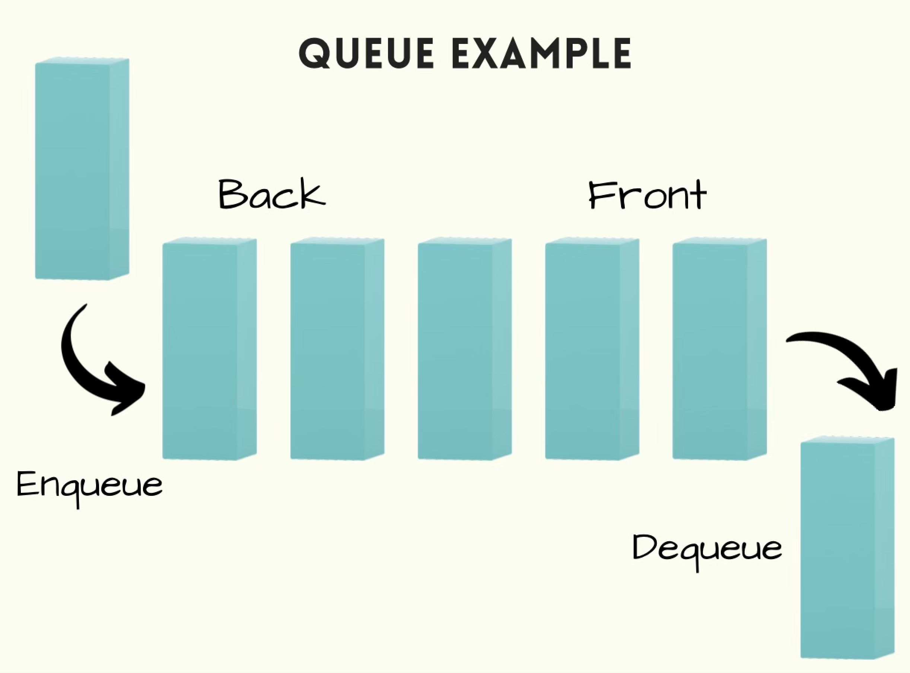

# Queue
A fast food business sells affordable food to customers in as little time as possible. These restaurants provide service by way of drive-thrus as well as traditional sit-down meals. Some customers opt to bring their order with them in a “to go” fashion. When the business is very popular you can expect a huge line of customers in any type of service when you are ready to order, but to your surprise the line was super fast so you can start ordering your food due to the **FIFO** (First In First Out) method. This method is what a **Queue** is. Queues are great for many things including:

* Operating Systems maintaining processes
* Watching and uploading videos
* Call center phone systems to find who is next after they are done with a caller
* Movies to keep track of the most recent films

<br>

Here is a diagram of using Queues:


<br>

## Python list functionality
Queues are very easily applied using lists. For the tutorial we will be using lists to learn Queues. Queues, like customer lines, need to allow people to go to the back of the line and leave the line after they have been helped. Here are some python list methods needed to compliment Queues:

<br>

|       Description         |      Python Code      |     Performance     | 
|      :-----------:        |     :------------:    |     :-----------:   |
|Add value to end of queue  |  queue.append(value)  |         O(1)        |
|Remove value from front    | value = queue.pop(0)  |         O(n)        |
|Get length of queue        |  length = len(queue)  |         O(1)        |
|Check if queue is empty    | if len(queue) == 0:   |         O(1)        |

<br>

## Why use queues over other data structures
As you can see up above the most time consuming performance was to remove an item from the queue. The performance was a worst case scenario of O(n) time. The reason why the .pop() method has this performance is because if you need to pop off the last item in the queue you would have to check every item in the queue before you got to the wanted index. Queues are very great performance wise but lets talk about why else it is good. Some of the reasons are:

* There is no need to know what is next since a queue is used for FIFO
* Well Organized
* Easy to learn
* Potential use of queues after only knowing a couple of python functionality

<br>

Using an example from above lets create a list of customers to imitate a line. This will be showing how to use all of the list functions up above.

# Example

```python
# Create a list of customers.
list_of_customers = ["Peter Parker","May Parker", "Ben Parker","Mary Jane"]


# Lets loop through the list as if we were 
while len(list_of_customers) != 0:
    
# We are using the First In First Out method,
# we will need to grab first item in the list and remove it.
 next_customer = list_of_customers.pop(0)
 print(next_customer, list_of_customers) 

# 1st iteration output: Peter Parker ['May Parker', 'Ben Parker', 'Mary Jane']
# 2nd iteration output: May Parker ['Ben Parker', 'Mary Jane']
# 3rd iteration output: Ben Parker ['Mary Jane']
# 4th iteration output: Mary Jane []


# Use the append function to add customers to the queue
list_of_customers.append("Harry Osborne")
list_of_customers.append("Green Goblin") 
print(list_of_customers) # Output ["Harry Osborne", "Green Goblin"]
```
<br>
<br>

# Problem to solve
We will be using the fast food scenario, and we are going to create the line for customers to order their food. We will be needing  mutiple things to recreate the scenario. Things we should include:
* A way to add people to the line
* A way to remove the first person from the line
* No need to add a person to the line if the line is over 10 people
* If out of food the system will end the program


Determine how to complete these tasks with the function names already created. Here are the functions and how they will be used in the program. You can use the following:

``` python
class Fast_food_restaurant:
    def __init__(self,max_size, stock):
        self.stock = stock
        self.max_size = max_size

        self.line = []

    def add_to_line(self, name):
        """
        Purpose: Add a person to the end of the line
        with the name given as an argument. Have a 
        conditional that will compare the queue size
        to the max size and return a phrase saying
        you cant add more people since the max size has
        been reached.
        """
        pass


    def remove_first_in_line(self):
        """
        Purpose: Remove the first person in the line.
        If someone is removed from the line we know that
        food is given away. Since everyone
        is only allowed 1 order, deduct from the stock here.
        """
        pass


    def subtract_from_stock(self):
        """
        Purpose: Subtract amount from food stock.
        """
        pass


    def get_line_size(self):
        """
        Purpose: Returns the size of the line
        """
        pass


    def out_of_food(self):
        """
        Purpose: Return a boolean to see if the restaurant
        is out of food.
        """
        pass


    def __str__(self):
        """
        Purpose: Loop through self.line and grab the names of all
        who are in the line. Return everyone in the line.
        """
        front = "[ "
        end = "]"
        names = ""
        for name in self.line:
            names += name + " "
        return front + names + end


stock = 8
line = Fast_food_restaurant(10, stock)

# ============== Test 1 ============== #
print("============== Test 1 ==============")
print()
line.add_to_line("Maya") 
line.add_to_line("Andres")
line.add_to_line("Lucca")
line.add_to_line("Lola")
line.add_to_line("Karl")
line.add_to_line("Alfredo")
print(line) # Output: Maya Andres Lucca Lola Karl Alfredo
print()

# ============== Test 2 ============== #
print("============== Test 2 ==============")
print()
line.remove_first_in_line()
line.remove_first_in_line()
print(line) # Output: Lucca Lola Karl Alfredo

line.add_to_line("Eduardo")
line.add_to_line("Vero")
line.add_to_line("Ezra")
line.add_to_line("Alberto")
line.add_to_line("Lina")
line.add_to_line("Luis")
print(line)  # Output: Lucca Lola Kalr Alfredo Eduardo Vero Ezra Alberto Lina Luis
print()

# ============== Test 3 ============== #
print("============== Test 3 ==============")
print()
line.add_to_line("Nancy") # Output: Line is too big! Wait for more people to leave.
line.add_to_line("Lucia") # Output: Line is too big! Wait for more people to leave.
print(line)  # Output: Lucca Lola Karl Alfredo Eduardo Vero Ezra Alberto Lina Luis

for person in range(line.get_line_size()):
    """
    We will then remove everyone from the line and give them
    the order of food. 

    Output: Enjoy! Have a great day!
    """
    if line.out_of_food():
        print("Have a great day!")

    line.remove_first_in_line()

print(line) # Ouptut: [ ]
``` 
You are more than welcome to  add more tests, or you can add more to the class (Fast_food_restaurant). Add a method that will allow people to ask how much food they want and deduct that from the stock. You can have fun while using Queues and you can create many functional programs too. Explore and have fun!


You can check your code with the solution here: [Solution](Solution_Code/Queue_solution.py)

[Back to Welcome Page](Welcome.md)
