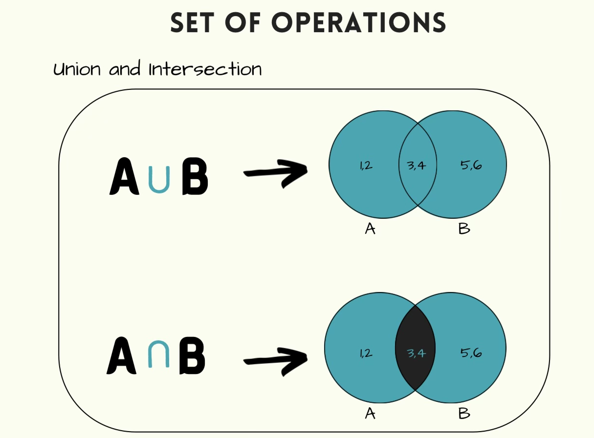

# Sets
Sets are a basic way to store data in python. They are unchangable, unordered, have no indexes, and does not allow any duplicates. Sets are good for many different things, in this case we are going to use it to find the difference OR similarities between two sets using the ***Union*** and ***Intersection*** methods. 

## Union
Union returns the set that contains all of the items from both, duplicates are not included. Union can be used using multiple sets, it can be used with 2 sets or even 10 sets. If an item is in more than one set, the union set will contain only one appearance of that item. A great use of this would be to altere out all of the duplicates in a list. If you compare two lists and want to get rid of duplicates in both lists, union will fix this.


## Intersection
Intersection returns a set that contains items that exist in both sets. For example, if you have a set of {1,2,3} and {3,4,5} it will return a set only containing 3. This function is great if for checking followers on multiple platforms for a company. Let say they wanted to check for all the people that followed them on multiple platforms. With Intersection, they can find all of these people easily.

## Example of Intersection and Union

``` python code

set_1 = {1,2,3,4,5,6,7,8}
set_2 = {4,5,6,7}

set_3 = set_1 & set_2 # Intersection example
set_4 = set_1 | set_2 # Union  exanple

print(set_3) # Result: 4,5,6,7
print(set_4) # Result: 1,2,3,4,5,6,7,8

for i in set_4: # Result: 1,2,3,4,5,6,7,8
    print(i)
```



## Performance of Sets
|       Description       |        Python Code            |     Performance     | 
|      :-----------:      |       :------------:          |     :-----------:   |
| Add value to set        |    set.add(value)             |         O(1)        |
| Remove value from set   |    set.remove(value)          |         O(1)        |
| Find value in set       |    if value in set:           |         O(1)        |
| Loop through set & print|    for i in set: <br> print(i)|         O(n)        |
| Get length of the set   |    length = len(set)          |         O(1)        |

The performance of sets are very fast. Almost every function of O(1) time 
the processing is almost immediate.


## Problem to solve
There is a  cell phone store and we need to find specific requests. The store manager wants you to find Apple and Samsung users from a prestigious soccer team. The request should include:
* Find out the customers that uses both platforms 
* Make one set that has all customers from both platforms and no duplicates.
* Remove people from both sets if they need to be removed.

Determine how to complete these tasks using sets. In this problem a list of names for the platforms is incluided and a templated function as well. You can use the following:

``` python

def intersection(names1, names2):
    """
    Purpose: Use intersection to make a new set.
    Return: New intersected set.
    """
    pass

def union(names1, names2):
    """
    Purpose: union to make a new set.
    Return: New set with unions.
    """
    pass

def add_names_to_sets(list_of_names1, list_of_names2):
    """
    Purpose: Add all of the names from 
    list 1 into the Apple users set and then add
    all of the names from list 2 into the 
    Samsung users set.

    Return: return a tuple containing both updatee
    sets.
    """
    apple_set = set()
    samsung_set = set()
    pass

def remove_name_from_sets(value, union_set):
    """
    Purpose: Remove user from list. 
    Return: The updated set.
    """
    pass


apple_users = ["Roberto Carlos", "Claude Makelele", "Romario Souza", "Ronaldo", "Guti", "Luis Figo", "Iker Casillas", "Sergio Ramos", "Zidane", "Arbeloa", "Beckham"]
samsung_users = ["Roberto Carlos", "Ronaldo", "Cassano", "Maldinni", "Raul", "Fabbio", "Gravessen", "Benzema", "Ozil", "Zidane", "Arbeloa", "Beckham"]

print("=================== Test 1 ===================")
print()
# Result: Because sets are unordered they will show a different result everytime. Make sure the corresponding sets contains the correct users.
phone_user_sets = add_names_to_sets(apple_users, samsung_users) 

print(intersection(phone_user_sets[0], phone_user_sets[1])) # Result: Contain names 'Zidane', 'Beckhams', 'Arbeloa', 'Roberto Carlos', 'Ronaldo'
print()

total_users = union(phone_user_sets[0], phone_user_sets[1])
print(total_users)  # Result: 'Romario Souzas', 'Arbeloa', 'Iker Casillas', 'Roberto Carlos', 'Benzema', 'Sergio Ramos', 'Guti', 'Zidane', 'Beckham', 'Fabbio', 'Gravessen', 'Cassano', 'Maldinni', 'Luis Figo', 'Ozil', 'Ronaldo', 'Claude makelele', 'Raul'


print("\n Roberto Carlos now has been using a different kind of phone. Please remove him from the Apple and Samsung platforms.")
name = input("Please enter the name that you would like to remove from the phone users(Apple & Samsung)> ") 
print(remove_name_from_sets(name, total_users)) # Result: Contain names: 'Romario Souza', 'Arbeloa', 'Iker Casillas', 'Roberto Carlos', 'Benzema', 'Sergio Ramos', 'Guti', 'Zidane', 'Beckham', 'Fabbio', 'Gravessen', 'Cassano', 'Maldinni', 'Luis Figo', 'Ozil', 'Ronaldo', 'Claude makelele', 'Raul'
```

You can check or compare your code with the solution here: [Solution](Solution_Code/Set_solution.py)

[Back to Welcome Page](Welcome.md)